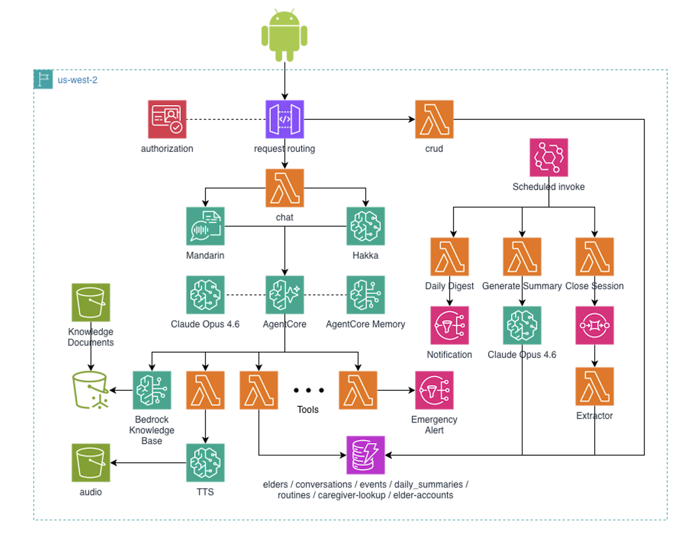

# 客照e點通 App

專為高齡長者與家屬設計的**智慧長照解決方案**——結合生成式 AI，打造具備情感陪伴、行程提醒與異常偵測的語音助理，並為家屬提供即時的照護儀表板。

## 系統核心模組

單一 Flutter App，登入後依角色（長者／照護者）切換模式：

| 模組 | 名稱 | 說明 |
|------|------|------|
| A | 語音互動陪伴 | 全語音介面、AgentCore Runtime 對話大腦（長期記憶 + 溫暖語氣）、行程追蹤、衛教知識庫問答 |
| B | 生活記錄與智慧摘要 | 從自然對話自動萃取結構化生活事件、每日產出身心靈摘要 |
| C | 照護者資訊介面 | 緊急警報、行程管理（用藥/回診/運動）、AI 健康摘要、事件時間軸與統計 |

## 技術架構



**技術選型**：
- **前端**：Flutter（單一 App 雙模式）
- **後端**：Python 3.13 Lambda + Bedrock Claude
- **基礎設施**：Terraform IaC（API Gateway / Lambda / DynamoDB / Cognito / S3 / SQS / EventBridge / SNS / SSM / CloudWatch，以及 SageMaker ASR／TTS 推論端點、Bedrock AgentCore 與 Knowledge Base）
- **對話 AI**：AWS Bedrock AgentCore Runtime + LangChain 工具鏈
- **語音辨識**：華語走裝置端辨識，客語錄音上傳後端 ASR（Formo 六腔 SageMaker，CE 為共同備援；後端另有 Amazon Transcribe 華語路徑）
- **語音合成**：全在後端，華語 BreezyVoice／Polly Zhiyu，客語 OmniVoice／VoxHakka；各端點有獨立的 enable 與 production 核准開關

## 目錄結構

```text
├── app/            # Flutter（elder/ caregiver/ 兩組頁面 + shared services）
├── backend/        # Python Lambda handlers + 對話大腦 + ASR/TTS 模組 + extraction pipeline
├── terraform/      # AWS IaC（API GW / Lambda / DynamoDB / Cognito / EventBridge / S3 / SageMaker）
├── asr-container/  # ASR 推論容器（FormoSpeech 客語六腔）
├── tts-container/  # TTS 推論容器（BreezyVoice 台灣華語、OmniVoice 客語）
├── data/           # 模擬 persona、情境腳本、seed 腳本、knowledge/ 衛教文件
├── docs/           # 系統框架、API 規格、使用者旅程、PII、開發慣例
│   └── features/   # 功能規格：asr/ tts/ adr/、每日摘要、模型選型
├── scripts/        # 全域工具腳本（知識庫上傳與同步）
└── .kiro/          # steering、specs、AI 工具 skill
```

各目錄皆有獨立 README：
[app/](app/README.md) ·
[backend/](backend/README.md) ·
[backend/src/](backend/src/README.md) ·
[data/](data/README.md) ·
[docs/](docs/README.md) ·
[asr-container/](asr-container/README.md) ·
[tts-container/](tts-container/README.md)

---

## 快速開始

### 1. 前端 App（Flutter）

> 平台檔案（`android/`、`web/`）已在版控內，**不要跑 `flutter create`**——會覆蓋麥克風權限、通知 receiver 等設定。

```bash
cd app
flutter pub get
flutter run
```

### 2. 後端（Python）

```bash
cd backend
python -m venv .venv
source .venv/bin/activate        # Windows: .venv\Scripts\activate
pip install -e ".[dev]"
python -m pytest                 # 執行測試
```

AgentCore Runtime 額外依賴：
```bash
pip install -r agentcore_requirements.txt
```

### 3. 基礎設施（Terraform）

```bash
cd terraform
cp terraform.tfvars.example terraform.tfvars   # 填入 API 金鑰等變數
terraform init
terraform plan
terraform apply
```

> `terraform.tfvars` 不進版控。裡面每個變數都有空字串預設值，漏填不會讓 apply 失敗，而是把線上既有的值安靜覆蓋成空的，apply 前請確認 plan 沒有這種改動。

### 4. 環境變數

在專案根目錄建立 `.env` 並填入 AWS 憑證與服務設定（所需欄位參考 `terraform/variables.tf`）。

---

## 文件導覽

### 核心架構與規格

| 文件 | 說明 |
|------|------|
| [docs/framework.md](docs/framework.md) | 系統框架：架構圖、模組設計、DynamoDB 表結構、Session 狀態機 |
| [docs/api.md](docs/api.md) | API 規格書：所有 REST 端點（App 與後端唯一契約） |
| [docs/llm_tools.md](docs/llm_tools.md) | 對話大腦各工具的觸發條件與 I/O |

### 語音子系統

| 文件 | 說明 |
|------|------|
| [docs/features/asr/framework.md](docs/features/asr/framework.md) | ASR 子系統架構 |
| [docs/features/asr/model-catalog.md](docs/features/asr/model-catalog.md) | ASR 模型目錄 |
| [docs/features/adr/asr-managed-transcribe-routing.md](docs/features/adr/asr-managed-transcribe-routing.md) | ASR 主備援決策 |
| [docs/features/tts/framework.md](docs/features/tts/framework.md) | TTS 子系統架構 |
| [docs/features/tts/implementation-plan.md](docs/features/tts/implementation-plan.md) | TTS 實作計畫 |
| [docs/features/model_selection_asr_tts.md](docs/features/model_selection_asr_tts.md) | ASR／TTS 模型選型比較 |

### 功能設計

| 文件 | 說明 |
|------|------|
| [docs/features/feature_daily-summarization.md](docs/features/feature_daily-summarization.md) | 每日摘要：排程生成、partial/complete、backfill |
| [docs/features/asr-agentcore-frontend-integration-plan.md](docs/features/asr-agentcore-frontend-integration-plan.md) | ASR／Agent／Frontend 整併計畫 |
| [docs/features/request_elder-lang-dialect-via-tool.md](docs/features/request_elder-lang-dialect-via-tool.md) | App → 後端需求：長者語言與腔調設定 |

### 使用者旅程

| 文件 | 說明 |
|------|------|
| [docs/user-journey.md](docs/user-journey.md) | 長者與照護者從註冊到日常使用的端到端情境 |

交付版文件（交付版使用者旅程、前端各資料流）放在 `docs/deliverables/`，依 [.gitignore](.gitignore) 不進版控，只存在於本機。

### 開發指南

| 文件 | 說明 |
|------|------|
| [docs/workflow.md](docs/workflow.md) | 分支策略與 Commit 慣例 |
| [docs/conventions.md](docs/conventions.md) | 命名、註解、測試規範 |
| [docs/local_testing.md](docs/local_testing.md) | 本機測試指南 |

---

## terraform/ — 基礎設施一覽

| 檔案 | 管理的 AWS 資源 |
|------|-----------------|
| `cognito.tf` | Cognito User Pool（認證與 JWT） |
| `api_gateway.tf` | API Gateway REST API（路由與 JWT 驗證） |
| `lambda.tf` | Lambda Functions（15 支） |
| `lambda_config_parameters.tf` | SSM Parameters（ASR／TTS 設定） |
| `dynamodb.tf` | DynamoDB Tables（7 張） |
| `sqs.tf` | SQS Queue + DLQ（batch 萃取佇列） |
| `eventbridge.tf` | EventBridge Scheduler（session close / 摘要 / digest） |
| `s3.tf` | S3 Buckets（TTS 音訊、KB 文件、Lambda 部署包） |
| `bedrock_kb.tf` | Bedrock Knowledge Base（衛教知識庫） |
| `bedrock_iam.tf` | Bedrock 呼叫與 KB 檢索 IAM |
| `agentcore.tf` | AgentCore Runtime 部署配置 |
| `asr_models.tf` | ASR SageMaker Endpoints |
| `asr_lambda_config.tf` | ASR 設定來源 |
| `tts_models.tf` | TTS SageMaker Endpoint |
| `tts_lambda_config.tf` | TTS 設定來源 |
| `tts_worker.tf` | 非同步 TTS 合成佇列、DLQ 與 worker Lambda |
| `cloudwatch.tf` | CloudWatch Alarms + SNS |
| `providers.tf` / `variables.tf` / `outputs.tf` / `versions.tf` | Provider、變數、輸出、版本鎖定 |

## scripts/ — 全域工具腳本

| 檔案 | 說明 |
|------|------|
| `build_kb_upload.py` | 將 `data/knowledge/` 衛教文件轉為 Bedrock KB 上傳格式 |
| `sync_kb.sh` | 同步知識庫至 S3 並觸發重新索引 |
